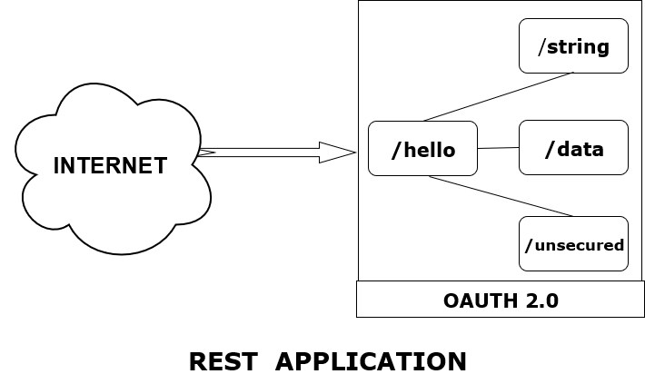

# EXAMPLE REST APPLICATION


### Introduction:
- Used to learn and test integration between Spring, Kotlin, and Spring Security.
- This is designed for Software Professionals who are willing to learn REST application in simple and easy steps.




### Getting Started:
- These instructions will help to get the understanding about the REST APPLICATIONS.

- And with this you will be able to run the project on your local machine for development and testing purposes.


### Prerequisites:

The following items should be installed in your system:

1 [JDK 1.8](https://docs.oracle.com/javase/8/docs/technotes/guides/install/install_overview.html )

2 [KOTLIN 1.2](https://kotlinlang.org/docs/tutorials/command-line.html )


### Installing:

When installing it's recommended to have step by step series of examples that tell you how to get a project running:


##### STEPS-


**1 To RUN the server:**

- Open a terminal in the project root directory.

- Run command
###### Windows
```
gradlew bootRun
```
###### Unix
```
./gradlew bootRun
```

 
**2 To run the development network:** 

-Navigate.
```
localhost:8086/hello/unsecured
```

-Ensure that you get "Beep boop" in return.

### Looking for something in particular?

| Spring Boot Configuration |Class or Java property files|
| --------------------------|----------------------------|
|   Main Class              |[Hello Application](/src/main/kotlin/bcs/testing/test/HelloApplication.kt)|
|   Properties Files        |[Application Properties](/src/main/resources/application.properties (edited))|                  


### Running the Tests:
In this  section we mentioned  commands to run the test:

**Gradle Test**
###### Windows
```
gradlew test
```
###### Unix
```
./gradlew test
```
### Deployment:

Follow the installation steps on your desired platform:

- Build the production server with gradlew build.

- Find the runnable .jar in build/libs

- Deploy this jar to your desired platform.

### Built With:

**1 Springboot-** Framework

**2 Intelij-** IDE

**3 Gradle-** Dependency Management

**4 Kotlin-** Language


### Credits:

[**Harrison Mckenzie**](mailto:harrison.mckenzie@bcstechnology.com.au)


### Acknowledgment:

- Spring Team

- [Baeldung](http://www.baeldung.com/) 
 


