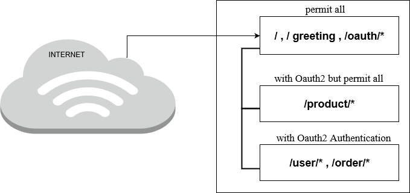

 # RESTFUL-LEARNING MASTER APPLICATION

### Introduction:
- Helping in learning and testing integration between `Spring` and `Spring Security`.

- Helpful for the Developers who are interested in `Restful Learning Master Application`.




### Getting Started:

- It starts from a clean base rather than including a load of files which are unnecessary.

- You can get information from this learning for testing and development purpose.

- Helpful in Rest Applications.

### You will learn: 
- You will be able to develop and design RESTful web services.
- Understand the best practices in designing RESTful web services
- Able to understand how to connect RESTful Services to a backend with JPA
- Understand how to version your RESTful Web Services
- Know how to monitor RESTful Services with Spring Boot Actuator


### Prerequisites:

This should be installed in your system:

- [JDK 1.8](https://docs.oracle.com/javase/8/docs/technotes/guides/install/install_overview.html )
- [Tomcat 8]( http://tomcat.apache.org/tomcat-8.0-doc/)


### Installing:

To get a project running successfully you have to follow the given steps:


##### STEPS-


**1 To RUN the server and application:**

- Install the application `.jar file` into the `Tomcat` application folder.
- Start Tomcat.
- Run the application.

 
**2 To run the development network:** 

- Navigate
```
localhost:8080/
```

- Ensure that you will get `welcome infor` in return.

### Looking for something in particular?

| Spring Boot Configuration |Class or Java property files|
| --------------------------|----------------------------|
|   Main Class              |[Application.main()]( https://github.com/BCSTechLearning/Restful-Learning/blob/roger/src/main/java/boot/Application.java)|
|   Properties Files        |[Application.yml](https://github.com/BCSTechLearning/Restful-Learning/blob/roger/application.yml)| 
|   Maven Configuration     | [pom.xml ]( https://github.com/BCSTechLearning/Restful-Learning/blob/roger/pom.xml ) |


### Deployment:

Follow the installation steps on your desired platform:

- Build the application with imbedded Eclipse run/build command.

- Export and deploy the project to Tomcat in a desired platform.

- Run Tomcat.


### Appplication Built With:

**1 Springboot-** Framework

**2 Eclipse-** IDE

**3 Maven-** Dependency Management


### Credits:

[**Roger Wang**](Lujie.Wang@bcstechnology.com.au)


### Acknowledgment:

- Spring Team
- Maven


 


